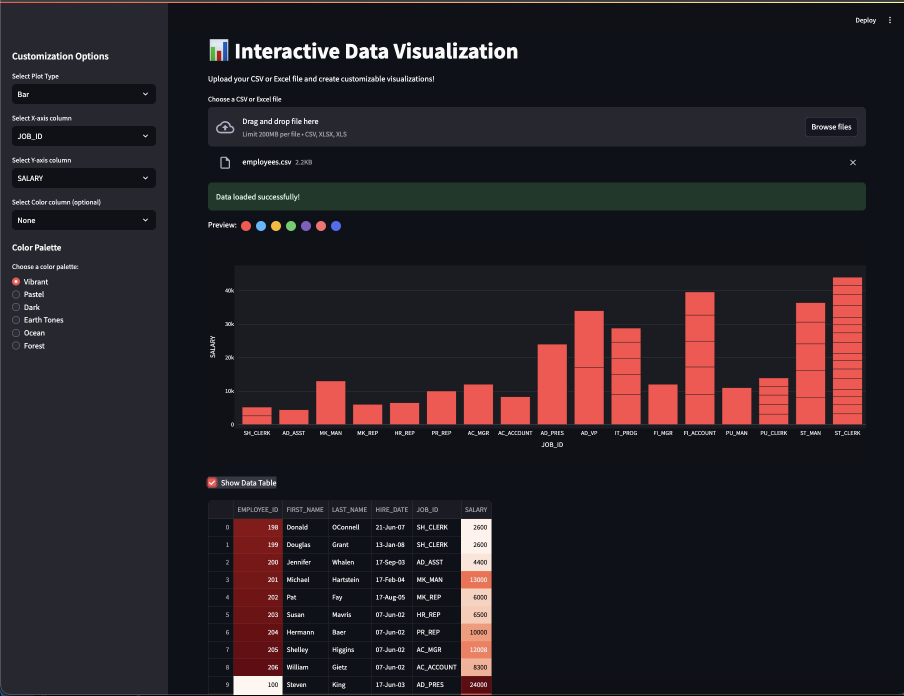

# 📊 Custom Chart Visualizer

A powerful and user-friendly Streamlit application that allows users to visualize their data through various interactive charts and graphs. Upload your CSV or Excel files and create beautiful visualizations with customizable colors and chart types!



## 🌐 Live Demo
Try out the live application here: [Chart Visualizer App](https://chart-visualiser.streamlit.app/)

## ✨ Features

- **File Support**: Upload data in CSV or Excel (xlsx/xls) formats
- **Multiple Chart Types**:
  - Bar Charts
  - Line Charts
  - Scatter Plots
  - Area Charts
  - Donut Charts
- **Customization Options**:
  - 6 Different Color Palettes:
    - Vibrant
    - Pastel
    - Dark
    - Earth Tones
    - Ocean
    - Forest
  - Interactive Color Preview
  - Flexible Axis Selection
  - Optional Color Grouping
- **Dark Mode**: Enhanced visual experience with dark theme
- **Responsive Design**: Works seamlessly on desktop and mobile devices
- **Data Table View**: Option to view the raw data with color-coded formatting

## 🚀 Getting Started

### Prerequisites
- Python 3.7 or higher
- pip (Python package installer)

### Installation

1. Clone the repository:
```bash
git clone https://github.com/agneya-1402/Streamlitt-Chart_Visualiser.git
cd Streamlitt-Chart_Visualiser
```

2. Install required packages:
```bash
pip install -r requirements.txt
```

3. Run the application:
```bash
streamlit run main.py
```

## 📝 Usage

1. Launch the application
2. Upload your CSV or Excel file using the file uploader
3. Select your desired chart type from the sidebar
4. Choose the columns for X and Y axes
5. (Optional) Select a column for color grouping
6. Pick a color palette that suits your needs
7. Explore your data visualization!

## 🛠️ Built With

- [Streamlit](https://streamlit.io/) - The web framework used
- [Plotly](https://plotly.com/) - Interactive visualization library
- [Pandas](https://pandas.pydata.org/) - Data manipulation and analysis
- [NumPy](https://numpy.org/) - Numerical computing tools

## 📈 Sample Visualizations

The app supports various types of visualizations including:

- Bar Charts for categorical comparisons
- Line Charts for trend analysis
- Scatter Plots for correlation studies
- Area Charts for cumulative trends
- Donut Charts for part-to-whole relationships

## 🤝 Contributing

1. Fork the project
2. Create your feature branch (`git checkout -b feature/AmazingFeature`)
3. Commit your changes (`git commit -m 'Add some AmazingFeature'`)
4. Push to the branch (`git push origin feature/AmazingFeature`)
5. Open a Pull Request

## 📄 License

This project is licensed under the MIT License - see the [LICENSE](LICENSE) file for details.

## 👏 Acknowledgments

- Thanks to the Streamlit team for creating an amazing framework
- Plotly for their excellent visualization library
- All contributors who help improve this project

## 📞 Contact

Agneya - [GitHub Profile](https://github.com/agneya-1402)

Project Link: [https://github.com/agneya-1402/Streamlitt-Chart_Visualiser](https://github.com/agneya-1402/Streamlitt-Chart_Visualiser)

---
Made with ❤️ by [Agneya](https://github.com/agneya-1402)
